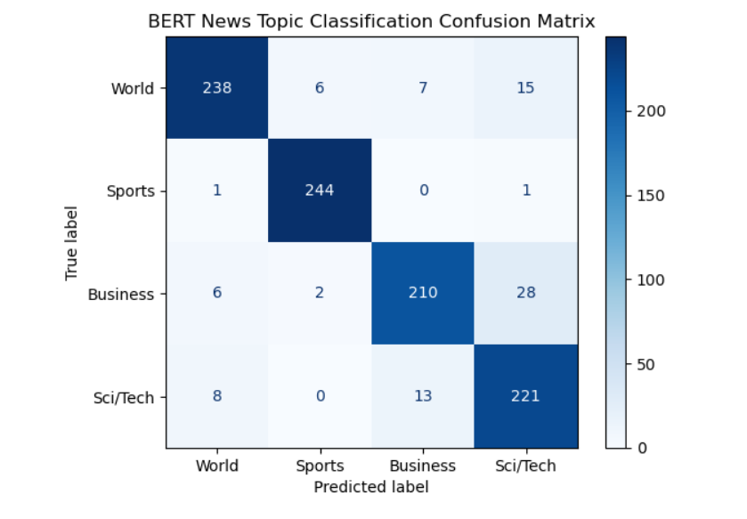
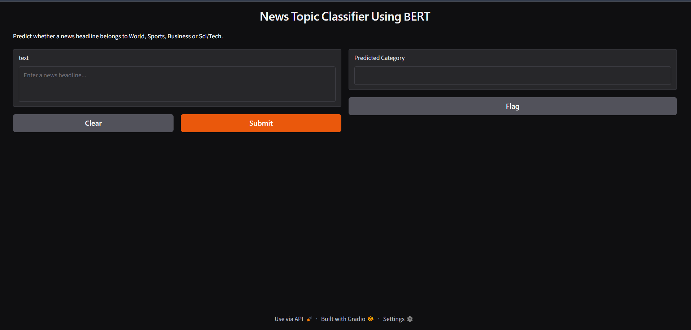
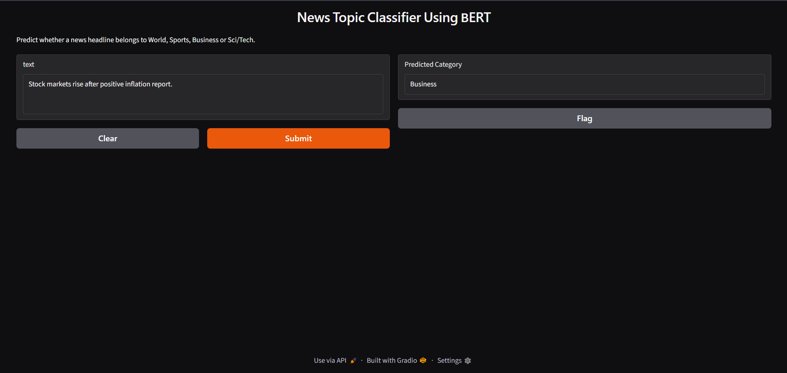

# News Topic Classifier Using BERT

## Overview

This project fine-tunes the **BERT (bert-base-uncased)** transformer model to classify news headlines into one of four categories using the **AG News Dataset**. The model is trained using the Hugging Face Transformers library and deployed through a **Gradio** web application for real-time predictions.

This project was completed as part of the **AI/ML Engineering Advanced Internship** at **DevelopersHub Corporation**.

---

## Objective

The objective of this project is to build an intelligent news classification system by fine-tuning a pre-trained BERT model. The application predicts the category of a news headline as one of the following:

* World
* Sports
* Business
* Sci/Tech

---

## Dataset

**Dataset:** AG News Dataset (Hugging Face)

The dataset contains news articles categorized into four classes:

| Label | Category |
| ----: | -------- |
|     0 | World    |
|     1 | Sports   |
|     2 | Business |
|     3 | Sci/Tech |

To accommodate CPU-only hardware, a representative subset of the dataset was used during fine-tuning. The implementation can be scaled to the full dataset without code changes.

---

## Technologies Used

* Python
* PyTorch
* Hugging Face Transformers
* Hugging Face Datasets
* Scikit-learn
* NumPy
* Pandas
* Matplotlib
* Gradio

---

## Methodology

1. Loaded the AG News dataset from Hugging Face.
2. Explored and analyzed the dataset.
3. Tokenized news headlines using the **bert-base-uncased** tokenizer.
4. Fine-tuned the pre-trained BERT model for four-class news classification.
5. Evaluated the model using Accuracy and Weighted F1-score.
6. Generated a Classification Report and Confusion Matrix.
7. Saved the trained model for inference.
8. Built a Gradio interface for real-time news category prediction.

---

## Model Evaluation

The model was evaluated using:

* Accuracy
* Weighted F1-score
* Classification Report
* Confusion Matrix

The trained model achieved strong performance on the evaluation dataset while training on a CPU-friendly subset.

---

## Project Structure

```text
Task-1-News-Topic-Classifier-BERT/
│
├── Task1_BERT_News_Classifier.ipynb
├── app.py
├── requirements.txt
├── README.md
├── saved_model/
└── images/
```

---

## Running the Project

### 1. Clone the repository

```bash
git clone <repository-url>
cd Task-1-News-Topic-Classifier-BERT
```

### 2. Install dependencies

```bash
pip install -r requirements.txt
```

### 3. Launch the Gradio application

```bash
python app.py
```

The application will start on a local server and can be accessed through the URL displayed in the terminal.

---

## Example Predictions

| News Headline                                      | Predicted Category |
| -------------------------------------------------- | ------------------ |
| Apple unveils its latest AI-powered chip.          | Sci/Tech           |
| Pakistan defeats Australia in the T20 series.      | Sports             |
| Stock markets close higher after inflation report. | Business           |
| World leaders meet to discuss climate change.      | World              |

---

## Results

Add your screenshots inside the **images** folder and display them below.

### Confusion Matrix

```markdown

```

### Gradio Interface

```markdown

```

### Sample Prediction

```markdown

```

---

## Key Learning Outcomes

* Transformer-based Natural Language Processing (NLP)
* Transfer Learning with BERT
* Text Tokenization and Preprocessing
* Fine-Tuning Pre-trained Models
* Performance Evaluation using Accuracy and F1-score
* Model Deployment using Gradio
* Building an end-to-end NLP application

---

## Acknowledgements

* Hugging Face Transformers
* Hugging Face Datasets
* PyTorch
* Gradio
* DevelopersHub Corporation
